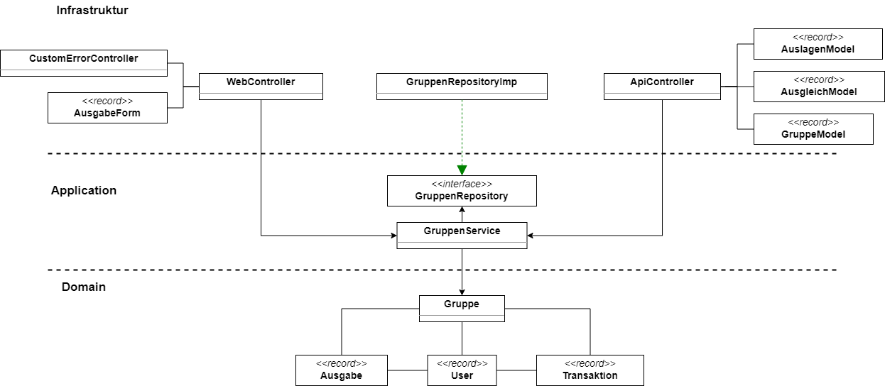

### Voraussetzungen:

- Umgebungsvariablen: CLIENT_ID und CLIENT_SECRET für GitHub OAuth

### Einleitung:

- Eine Software, die über eine Git-Authentifizierung Gruppen erstellen kann, in denen Ausgaben gespeichert und Ausgleichtransaktionen berechnet werden können
- Die Gruppenkonten sollen dabei möglichst transparent und einfach ausgeglichen werden.

#### Qualitätsziele:

Es soll möglichst wartbar sein.
Zudem wollten wir einen gewissen Grad an Accessibility gewährleisten, indem wir die einzelnen Features in der Software möglichst leicht und auffällig beschreiben. +
Des Weiteren sollte die Software alle Vorgaben der Stakeholder zufriedenstellen (User können Ausgaben angeben, Gruppen erstellen, Teilnehmer hinzufügen und sollten zudem die möglichst minimal zu tätige Transaktion ausgeben).

### Beschränkungen/ Bedingungen:

- Transaktionen sollten möglichst minimal sein
- Als OAuth-Provider benutzen wir GitHub
- Onion-Architektur als Architekturmuster
- Die Anwendung soll als Webanwendung mit Spring Boot umgesetzt werden.
- Die Anwendung soll auf Port 9000 laufen
- Als Datenbank wird PostgreSQL verwendet. Die Datenbank muss in einem Docker-Container laufen.
- Datenbank-Tests werden mit H2 umgesetzt und müssen auch laufen, wenn Docker ausgeschaltet ist.
- In der Domänenschicht müssen die taktischen DDD-Muster verwendet werden.
- Google-Styleguides sollen eingehalten werden
- Als MVP, da straffer Zeitplan (3 Wochen)

### Kontextabgrenzungen:

### Strategien für Lösungen: zentrale Entwurfsentscheidungen und Lösungsstrategien:

Im Vorhinein:

- Personen zu Gruppen hinzufügen und speichern
- Ausgaben speichern und diese in Tabellen speichern welche Person an welche Person was schuldet.
Algorithmus für *maximal* m-1 Transaktionen (beinahe minimal): Man macht eine Art Matrix, welche die einzelnen Differenzen von Schulden bzw. Salden zwischen Personen in der selben Gruppe berechnet. Bsp:

[options="header"]
|================
| / | A  | B | C | D
| A | 0  | 8 | 5 | 0
| B | 3  | 0 | 7 | 11
| C | 10 | 1 | 0 | 6
| D | 2  | 5 | 4 | 0
|================

Vertikale Summe: Salden, Horizontale Summe: Schulden

Als Beispiel B schuldet A 8$. +
Hierbei summieren wir zuerst die vertikalen und die horizontalen Summen pro User.
So kommen wir beispielsweise bei A auf 13 $ Salden und 15$ Schulden.
Diese rechnen wir dann zusammen (Salden-Schulden) und kommen auf 2$. +
Falls wir alles nach diesem Verfahren berechnen, kommen wir auf folgende Ergebnisse:

|====
|   User   |   Salden
| A | 2$
| B | -7$
| C | -1$
| D | 6$
|====

Um die Transaktionen minimal zu halten, testen wir als Erstes, ob bestimmte Salden und Schulden sich ausgleichen.
Falls dies der Fall ist, werden diese zu Beginn berechnet und schon ausgeglichen. +
Falls dies nicht der Fall ist, vergleichen wir herabsteigend alle User miteinander. +

So vergleichen wir in unserem Beispiel zuerst User A mit User B. Dabei sehen wir, dass User B 2$ seiner Salden von User A bekommen kann. +

|====
|   User   |   Salden
| A | 2$
| B | -7$
|====

Da User A nun bei 0$ ist, kann dieser aus der Saldenliste entfernt werden.
Jetzt aktualisieren wir den Wert von User B auf -5$ . +

|====
|   User   |   Salden
| B | -5$
| C | -1$
| D | 6$
|====
Da User A entfernt wurde vergleichen wir nun User B mit User D und User D überweist User B dann 5$. +
|====
|   User   |   Salden

| C | -1$
| D | 1$
|====
Nun aktualisieren wir User D und User D gibt User C das restliche Geld. +
So haben wir *immer* im Worst-Case _m-1_ Transaktionen. +

---

Beispiel für ein best-case: m/2 Transaktionen:

Man bekommt folgende Ausgabenliste:
|====
|   User   |   Salden
| A | 2$
| B | -2$
| C | -6$
| D | 6$
|====

Hier hat man durch den anfänglichen Algorithmus, indem man schaut, dass gleiche Beträge sich ausgleichen nur 2 Transaktionen. +
Hier: User A überweist User B 2$ und User D überweist User C 6$.

#### 2. Version: Minimale Ausgabe

Im Vorhinein:
- Personen zu Gruppen hinzufügen und speichern - Ausgaben speichern und in Tabelle speichern von welcher Person/an welche Person

Da es sich hierbei, um ein NP-Vollständiges Problem handelt, könnte dies zu immensen Laufzeitproblemen führen. +
Hierbei würde man wie gerade eine Matrix im Vorhinein erstellen und dabei die einzelnen Differenzen für jeden User erstellen. +
Nun vergleicht man aber jede nur mögliche Transaktion miteinander.
So würde man hierbei 2 Listen machen (Eine für die der Schuldigeren und eine für die der Gläubiger). +
So würde man jede mögliche Kombination der Listen mit jeder möglichen Kombination der anderen Liste vergleichen.
Falls dabei eine Kombination sich mit einer der anderen Liste ausgleicht, werden diese schon im Vorhinein entfernt.

### Hierarchische Struktur des Codes:

- Domain: Hier werden Ausgaben, Gruppen (Aggregat), Transaktionen und User geladen.
Zudem haben wir in dieser Schicht unsere Services für die einzelnen Modelattribute geladen. +
Insgesamt laden wir hier den inneren Teil der Onion-Architektur.
Hier werden zudem erste Regeln und Standardmethoden deklariert.
Unser Aggregat hierbei ist die Gruppe und bei Ausgaben, Transaktionen und User handelt es sich um Wertobjekte.
- Web: Hier wird der Controller gespeichert.
Leitet Informationen von Aufrufen der Clients an die Geschäftslogik weiter. +
Greift auf Application und Domain zu.
- Application: Greift auf die Domain zu.Hier werden Abfragen weitergeleitet durch Methoden von dem Controller an die Domain.
- Persistenz: Speicherung von Daten.

### Laufzeiten: Wie arbeiten Systembausteine mit Nachbarsystemen zusammen? Wie werden diese ausgeführt?

1. Client macht einen Aufruf.
2. Methode wird im WebController aufgerufen. Jetzt finden erst Checks statt in Form von notwendigen Authentifizierungen.
3. Nach der Authentifizierung werden einzelne Methoden von der Application-Schicht aufgerufen und der Client  kann beispielsweise neue Ausgaben erstellen, Gruppen hinzufügen, nach Transaktionen fragen etc.

### Technische Infrastruktur:

- Mob/Pair-programming
- Framework Spring Boot
- Postgres als Datenbank
- Tests laufen über H2
- Docker und Gradle benutzt
- Javaversion 17 benutzt
- Als IDE IntelliJ
- Git als zentrale Versionsverwaltung
- Google-Checkstyle

### Architekturentscheidungen:

- Wie stellen wir sicher, dass die Transaktionen minimal gehalten werden?
Alle Ausgaben und Einnahmen werden miteinander zusammengerechnet.
Es wird versucht, möglichst schnell alle Ausgaben und Einnahmen auszugleichen, um diese auf 0$ zu setzen.
- Wie können wir alle Ausgaben für die User speichern und möglichst genau zusammenrechnen?
Alle Werte der Ausgaben werden pro Gruppe gespeichert.
Dabei haben diese einzelne IDs.
Rechnungen erfolgen zudem mit BigDecimal.
- Wie sollten die Gruppen aufgebaut sein?
Haben uns entschieden, dass jeder Teilnehmer einer Gruppe beliebig viele Teilnehmer hinzufügen kann.
Dies ist aber auch nur möglich, bis die erste Ausgabe hinzugefügt wird.
- Wieso haben wir uns für künstliche Schlüssel entschieden?
Um eindeutige Attribute in der Gruppe zu haben.
Zudem ist es besser wartbar.

### Qualitätsanforderungen:

- Wartbarkeit: Unser System ist wartbar.
- Erweiterbarkeit: Da wir strikt nach der Onion-Architektur vorgegangen sind, müsste das System auch für andere Programmierer leicht erweiterbar sein.
- Code-Smell: Haben darauf geachtet, keine Code-Smells einzubauen.
- Testbar: Haben viele Teste geschrieben und sind konsequent nach TDD vorgegangen.
- Effizienz: Wir haben geschaut, dass unsere Laufzeit nicht zu lange ist.
So sollte das System zudem auch für schwache Rechner funktionieren.
- Nutzbarkeit: Wir haben alle einzelnen Aktionen, die die Teilnehmer ausführen können, möglichst einfach versucht darzustellen.
- Accessibility: Wir haben versucht, die Anwendung auch möglichst klein zuhalten.
Zudem haben wir versucht, es leicht bedienbar zu halten.
- Code-Verständlichkeit: Unser Code sollte durch Kommentare, gute Strukturierung und einfache Methodennamen möglichst leicht nachzuvollziehen zu sein.
- Fehlerhandling: Man sollte durch eine einfache Beschreibung der Fehler erkennen, was falsch sein sollte.

### Schwächen, Risiken, Welche probleme könnte es geben?

Wir haben versucht, dass möglichst wenige Schwierigkeiten auftreten könnten. Problematisch ist, dass es Fälle gibt, wo wir nicht die absolut minimale Transaktionsgrösse vorweisen.
Jedoch könnte die minimale Transaktionsgröße aber auch Laufzeittechnisch zu enormen Problemen führen (NP-vollständiges Problem).

### Glossar:

Haben keine schwierigen Begriffe benutzt, weshalb dies keine Probleme darstellen müsste.